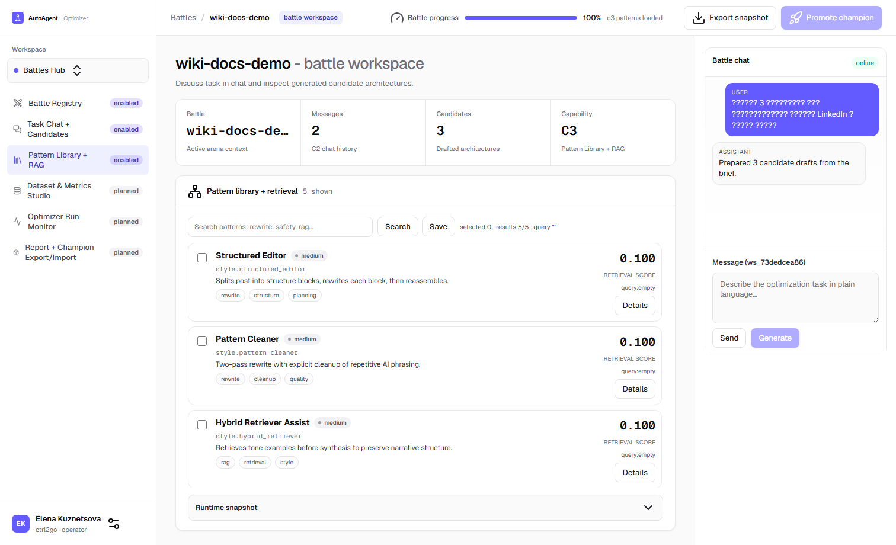
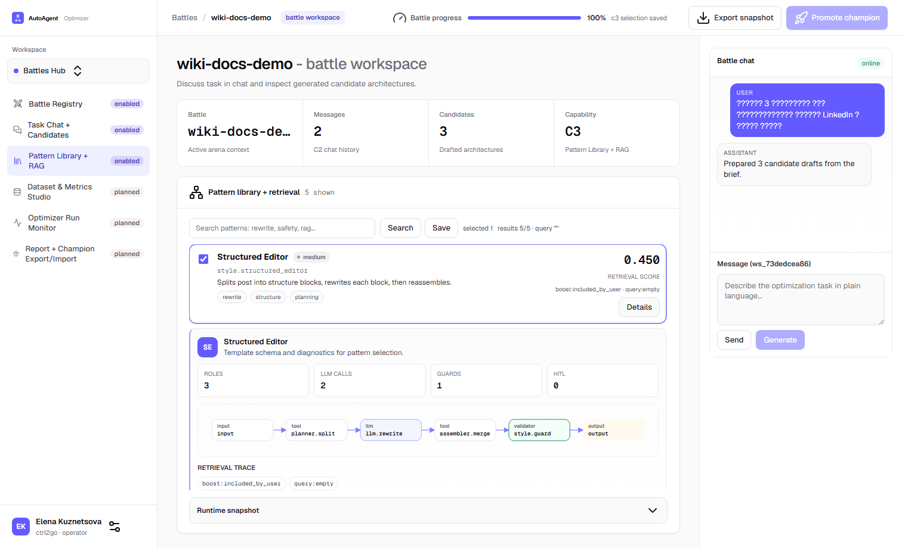

# C3 Pattern Selection (Unified Checkbox UX)

## What Changed (V2.3.S4a)

C3 now uses the same selection model as C2:

1. One checkbox per pattern row.
2. One shared `Save` button above the list.

## How to Use

1. Open `Pattern Library + RAG`.
2. Find target patterns via search/filter.
3. Check patterns you want to include for candidate generation.
4. Click `Save`.
5. To remove a pattern, uncheck it and click `Save` again.

## Real C3 Screens

### Pattern List

### Expanded Pattern Details

## Important Notes

1. Selection is stored in arena state and reused in next candidate generation.
2. Pattern details and mini-graph accordion are independent from selection.
3. Save is explicit: changes apply only after clicking `Save`.
