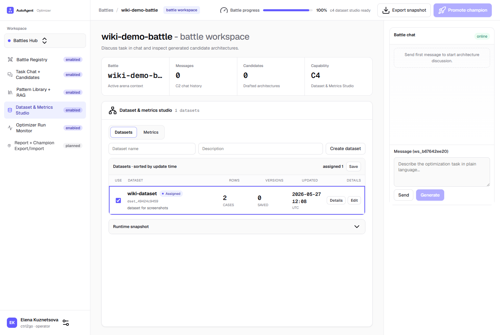
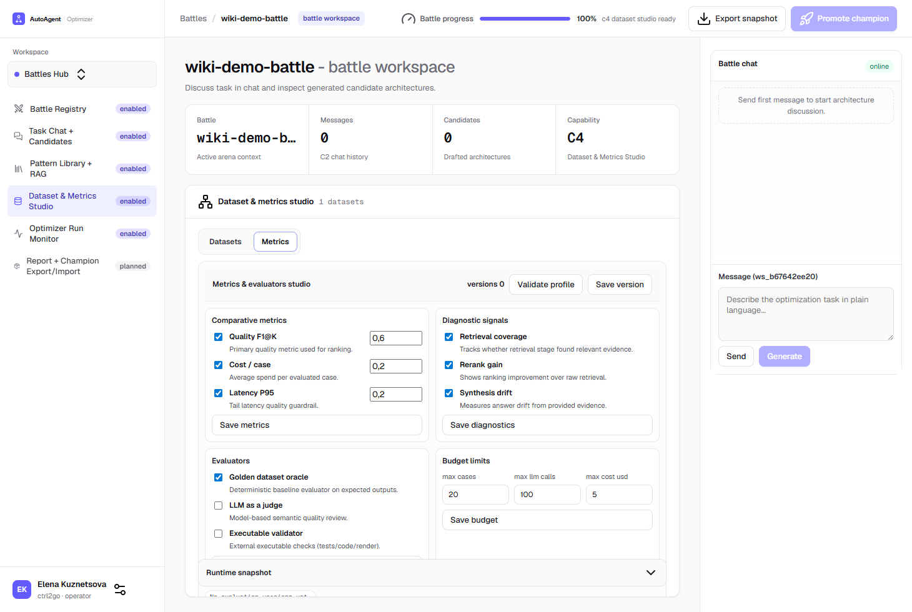

# C4 Dataset Studio

C4 используется для подготовки тестового набора перед оптимизацией.

## Что доступно в v0

1. Создать dataset внутри Battle Workspace.
2. Отметить dataset-ы чекбоксами и сохранить назначение в арену кнопкой `Save`.
3. Открыть `Details` и увидеть превью первых 5 строк.
4. Открыть `Edit` и перейти в отдельный экран редактирования dataset.
5. В editor-экране редактировать/удалять/добавлять строки и импортировать JSONL.
6. Проверить dataset (`Validate`) и сохранить snapshot (`Save version`).
7. Перейти во вкладку `Metrics` и настроить профиль оценки:
   - comparative metrics,
   - diagnostic signals,
   - evaluators,
   - budget limits.
8. Проверить профиль через `Validate profile` и сохранить версию `Save version`.

## Скриншоты (реальный UI)

### Dataset tab

### Metrics tab

## Минимальный поток

1. Откройте capability `C4 Dataset Studio`.
2. Введите имя датасета и нажмите `Create dataset`.
3. Отметьте датасет галочкой в списке и нажмите `Save`.
4. Нажмите `Edit` у нужного датасета.
5. Обновите строки, затем нажмите `Save changes`.
6. Нажмите `Validate`.
7. Если ошибок нет, нажмите `Save version`.
8. Переключитесь на вкладку `Metrics`, настройте метрики/evaluators/budget и сохраните их.
9. Нажмите `Validate profile`, затем `Save version` для профиля оценки.

## Формат кейса

Каждая строка содержит:

1. `case_id` — уникальный идентификатор кейса.
2. `input` — исходный текст/запрос.
3. `expected` — ожидаемое поведение/ответ.
4. `notes` — дополнительный комментарий (опционально).

## Как читать Validate

1. `error` — блокирующая проблема (например, пустой `input`, дубликат `case_id`, пустой dataset).
2. `warning` — неблокирующее замечание (например, пустой `expected`).

## Что дальше

После сохранения версии датасета переходите к следующему capability-слайсу (Optimizer Setup в C5).
