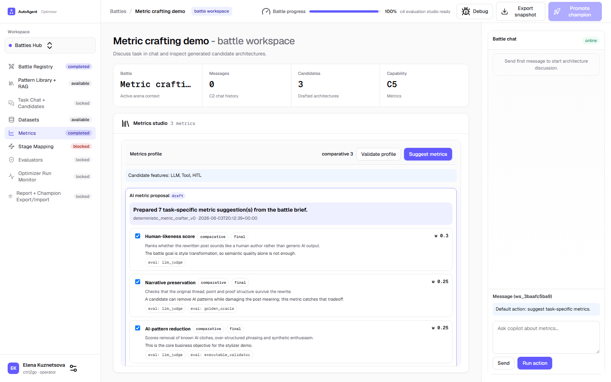

# C5 Metrics Studio

## What It Is

C5 Metrics Studio defines how candidate agents will be compared and diagnosed before evaluators are configured.

This screen is intentionally separate from datasets and evaluators:

1. datasets describe what cases or stage targets are available,
2. metrics describe what quality/cost/diagnostic questions matter,
3. evaluators describe how each metric will be measured.

## Metric-Crafting Proposal

`I5.S3` adds a task-specific metric proposal loop.

Main controls:

1. `Suggest metrics` creates an AI/deterministic draft proposal from the current battle context.
2. Proposal checkboxes let you choose which metric items should be accepted.
3. `Apply selected` writes only selected proposal items into the active evaluation profile.
4. Applying a proposal creates a new evaluation profile version.

Important behavior:

1. suggestions do not change the profile until `Apply selected`,
2. already existing metrics are not duplicated,
3. review-only proposal items cannot be applied,
4. evaluator compatibility is recalculated after apply.

## Screenshot (Real UI)

## Manual Test Scenario

1. Open a battle workspace.
2. Select patterns in `Pattern Library` and save.
3. Select at least one candidate in `Candidate architectures` and click `Select for tests`.
4. Open `Metrics`.
5. Click `Suggest metrics`.
6. Verify that `AI metric proposal` appears.
7. Uncheck one proposal item.
8. Click `Apply selected`.
9. Verify that selected metrics appear in Comparative metrics or Diagnostic signals.
10. Open `Evaluators` and verify the evaluator x metric matrix includes the newly applied metric rows/cells.

## How To Know It Works

The feature works when:

1. proposal appears without changing the existing metric list,
2. applying selected items changes the metric list,
3. a new evaluation profile version appears,
4. unsupported evaluator links stay disabled after the matrix refresh.
