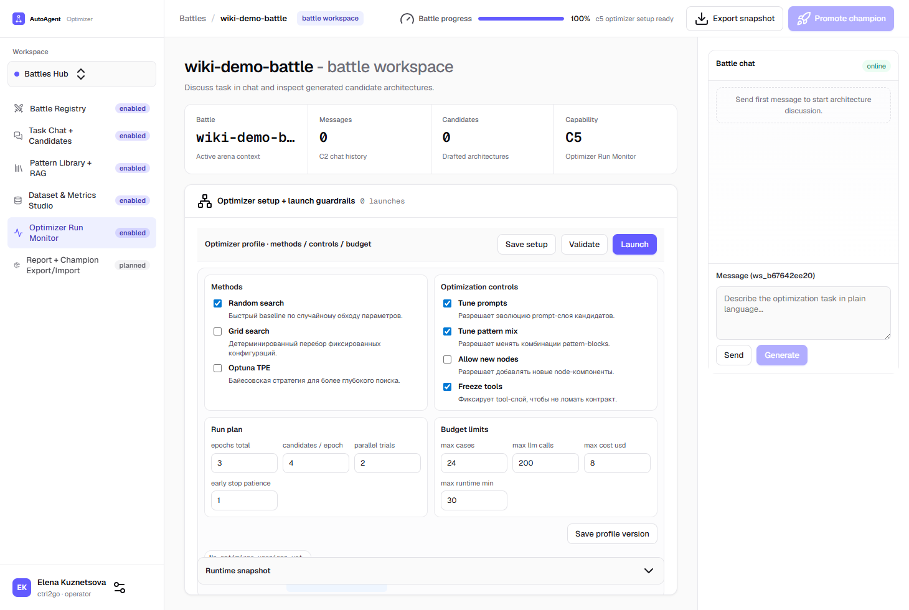

# C5 Optimizer Setup

## Что это

C5 — это этап перед запуском оптимизации.
Здесь вы сохраняете профиль запуска и проверяете preflight guardrails.

## Что настраивается

1. `Methods` — стратегии поиска конфигураций (`random/grid/optuna` и т.д.).
2. `Optimization controls` — какие части архитектуры можно менять.
3. `Run plan` — эпохи, кандидаты на эпоху, параллелизм, early-stop.
4. `Budget limits` — лимиты кейсов, LLM-вызовов, стоимости и времени.

## Скриншот (реальный UI)

## Основной flow

1. Откройте capability `C5 Optimizer Run Monitor`.
2. Отметьте нужные методы и controls чекбоксами.
3. Заполните `Run plan` и `Budget limits`.
4. Нажмите `Save setup`.
5. Нажмите `Validate` и проверьте статус preflight.
6. Если статус `ready` или `warnings`, нажмите `Launch`.
7. При необходимости нажмите `Save profile version`.

## Guardrails (что блокирует запуск)

1. Нет выбранных кандидатов для тестов в C2.
2. Compile gate кандидатов не в состоянии `ready`.
3. Нет назначенных dataset-ов в C4.
4. C4 evaluation profile в статусе `invalid`.
5. Невалидные run-plan/budget поля (например, epochs = 0).

## Что увидите после запуска

1. В `Launch queue` появится запись `run_id` со статусом `queued`.
2. В `Runtime snapshot` — payload последнего действия launch.

Следующий слайс C5 расширяет это до детального Run Monitor timeline.
