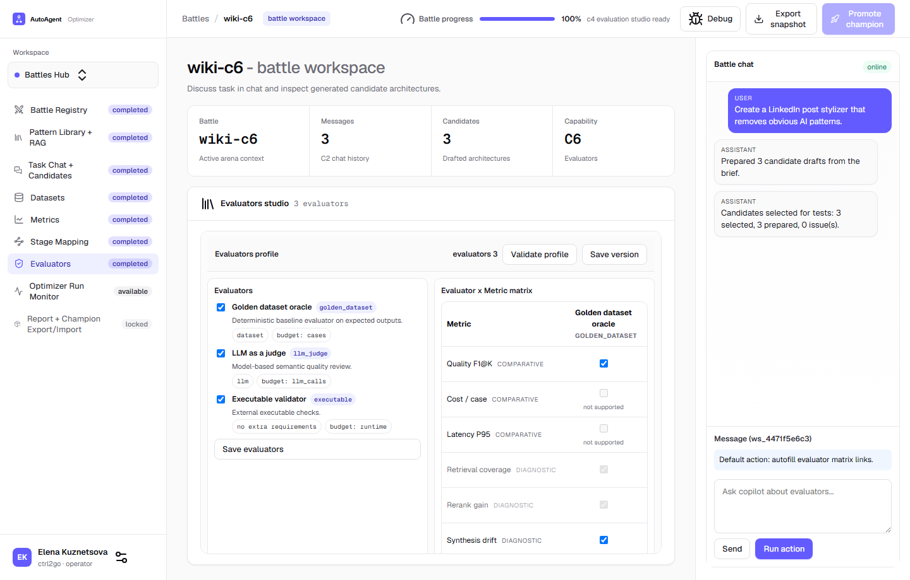

# C6 Evaluators Matrix

## Purpose

Use C6 to explicitly define which evaluator adapter is responsible for which metric/signal.

This prevents invalid evaluation profiles where metrics are enabled but no evaluator actually scores them.
It also prevents assigning a metric to an evaluator that cannot produce that kind of score.

## Real UI Screenshot

## How to Use

1. Open a battle workspace.
2. Go to `Evaluators` in the left wizard menu.
3. Enable required evaluators in the `Evaluators` card.
4. Read evaluator metadata:
- adapter kind, for example `golden_dataset`, `llm_judge`, `executable`,
- requirements, for example `dataset`, `llm`, `stage mapping`,
- budget model, for example `cases`, `llm_calls`, `runtime`.
5. In `Evaluator x Metric matrix`, check cells to assign evaluator coverage:
- rows are comparative metrics and diagnostic signals,
- columns are enabled/available evaluators.
6. If a cell shows `not supported`, that evaluator cannot score that metric.
7. Click `Save matrix`.
8. Click `Validate profile`:
- `ready`: matrix and stage bindings are valid,
- `invalid`: missing evaluator links or invalid stage binding coverage.

## Validation Rule

For each enabled metric/signal, at least one enabled evaluator must have an enabled and compatible matrix link.

For enabled non-final diagnostics, valid stage mappings must exist in the dedicated `Stage Mapping` step.

## Adapter Rules

1. `Golden dataset oracle` requires assigned datasets and supports expected-output style checks.
2. `LLM as a judge` requires configured LLM credentials and consumes LLM-call budget.
3. `Executable validator` is used for deterministic runtime/test/render-like checks.
4. Unsupported matrix cells are disabled by UI and rejected by backend validation if forced through API.
