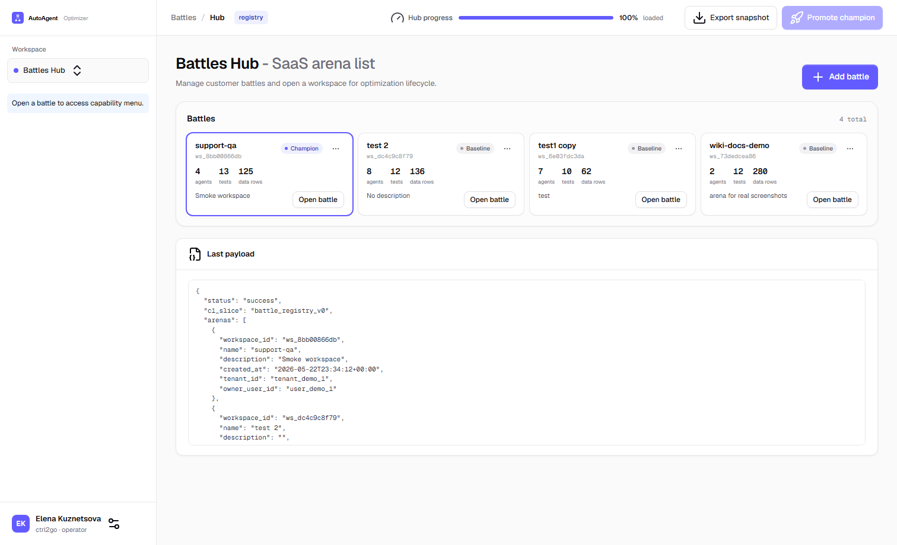
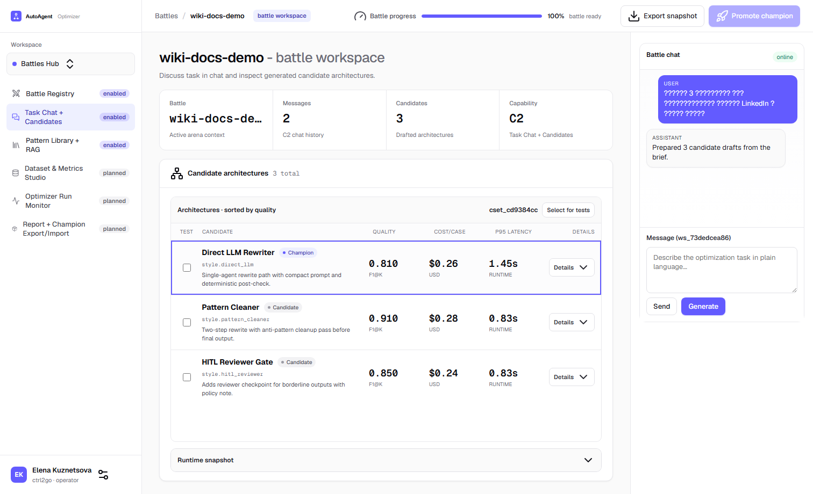
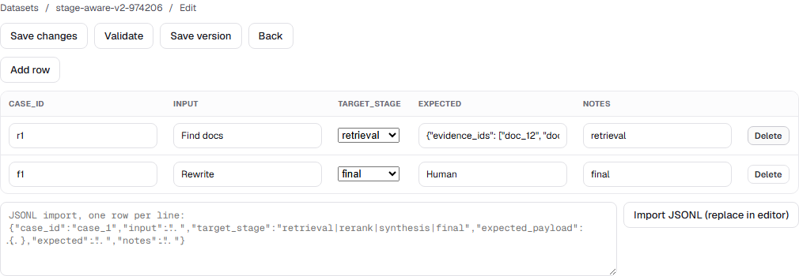

# User Guide Overview

## Real UI Screenshots

### Battles Hub

### Battle Workspace (C2)

### Battle Workspace (C3)

### Battle Workspace (C4 Dataset Editor v2)

### Battle Workspace (C6 Evaluators)

## Core User Flow

1. Create or open a battle in Battles Hub.
2. In C3, select architecture patterns and save via `Save`.
3. In C2, describe the task and click `Generate` to build candidate architectures.
4. In C2, select candidates via checkboxes and run `Select for tests`.
5. In C4, prepare datasets, assign selected datasets, and save.
6. In C5, configure comparative metrics + diagnostic signals and save profile.
7. In C5s, verify stage mapping (auto-map + manual adjustments if needed).
8. In C6, configure evaluators and `Evaluator x Metric` matrix.
9. In C7, save optimizer setup, run `Validate`, then click `Launch`.
10. Monitor launch queue and proceed to run-monitor stages.

## Contextual Right Chat (V2.4.S6)

Right chat is step-aware and changes behavior by active wizard tab:

1. C2: regular task chat + candidate generation.
2. C4: contextual action `add_dataset_row`.
3. C5: contextual action `enable_default_metrics`.
4. C5s: contextual actions `auto_map_stage_mappings` / `add_mapping_row`.
5. C6: contextual action `autofill_matrix_links`.
6. C7: contextual action `validate_optimizer_setup`.

## Internal Processes (Hidden from User)

1. Candidate validation and compile readiness checks.
2. Internal auto-fix/retry attempts for preparation errors.

The user should see only the final state: candidate ready for tests, or explicit request for manual attention.
